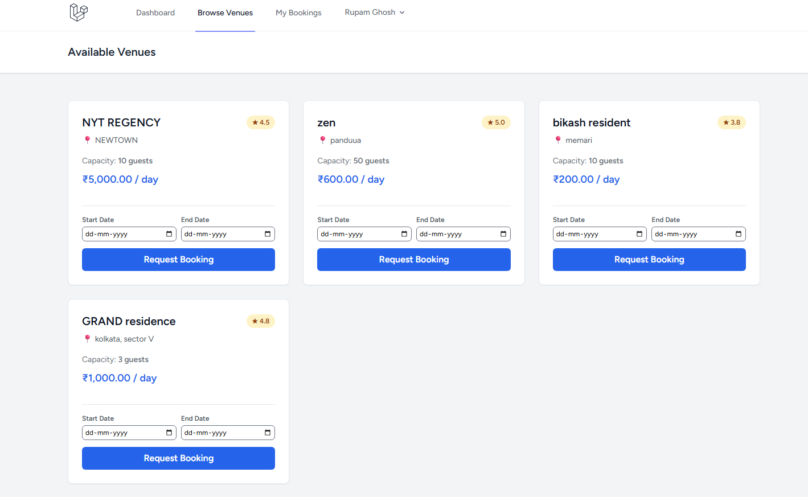
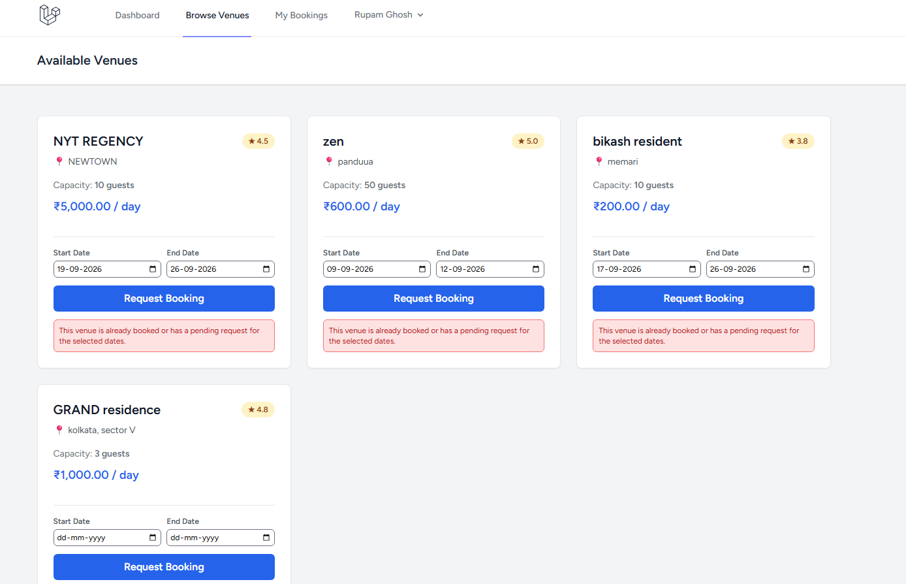
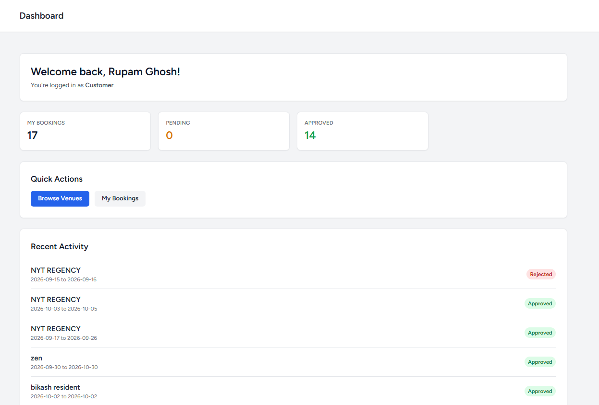
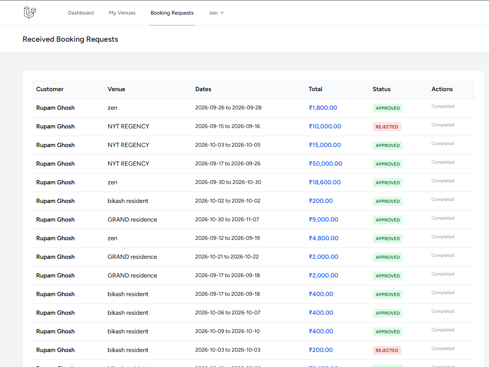
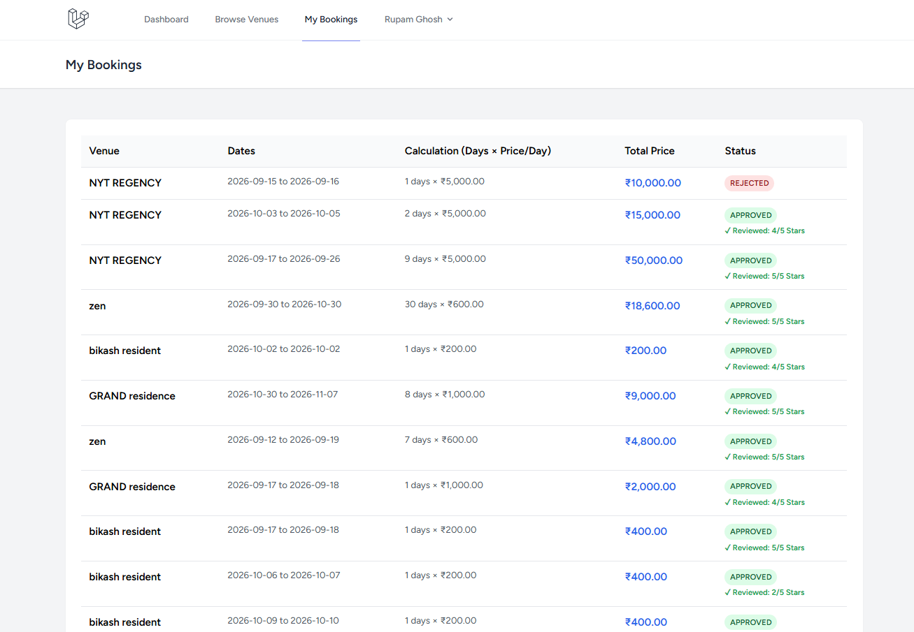

# Venue Booking Platform

A full-stack web application built with Laravel where vendors list venues and customers book them. Includes role-based dashboards, AJAX-powered booking, conflict prevention, and a review system.

## Features

- **Authentication** — Register / login with role-based access (vendor or customer)
- **Vendor Features**
  - Add, edit, and delete venues
  - Upload venue images
  - View all incoming booking requests
  - Approve or reject bookings
  - Dashboard with revenue and booking stats
- **Customer Features**
  - Browse all venues
  - Search by name, location, or price
  - Request bookings with AJAX (no page reload)
  - See inline error messages when dates conflict
  - Cancel pending bookings
  - Leave reviews after an approved stay
  - View booking history with cost breakdown
- **Booking System**
  - Prevents double bookings using date-overlap detection
  - Returns proper HTTP status codes (200 / 422)
  - Inline validation errors shown inside each venue card

## Tech Stack

| Layer | Technology |
|---|---|
| Backend | Laravel 11 |
| Database | MySQL |
| Frontend | Blade + Tailwind CSS |
| Interactivity | Vanilla JavaScript (Fetch API) |
| Auth | Laravel Breeze |

## Screenshots

### Catalog — Browse and filter venues

### Venue Detail — AJAX booking with inline error handling

### Role-Aware Dashboard

### Vendor — Manage Booking Requests

### Customer — My Bookings

## Setup Instructions

1. Clone the repository:
   git clone https://github.com/your-username/venue-booking.git
   cd venue-booking

## Install dependencies:

composer install
npm install

## Set up environment:

cp .env.example .env
php artisan key:generate

## Configure your database in .env:

DB_DATABASE=venue_booking
DB_USERNAME=root
DB_PASSWORD=

## Run migrations and seed:

php artisan migrate --seed

## Create storage link:
php artisan storage:link

## Build frontend assets:

npm run build

## Start the server:

php artisan serve
Visit http://localhost:8000

## Live Demo
🔗 Live URL: (add after deployment)

## Test Accounts:

Vendor: vendor@example.com / password
Customer: customer@example.com / password

## What I Learned
Building an AJAX booking flow with proper HTTP status codes

Preventing race conditions with database-level overlap queries

Role-based access control in Laravel

Handling form validation across frontend and backend

## License
MIT

---

